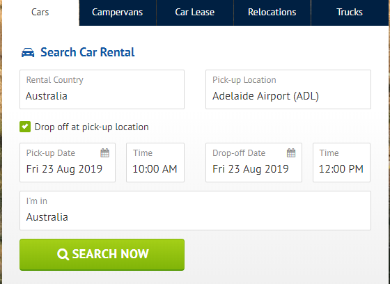
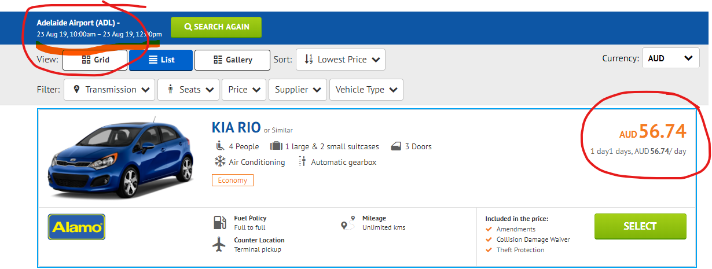
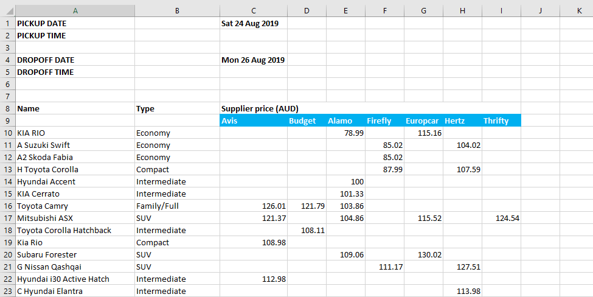

# Drivenow Project

`Caution: As this is web scarping task with automation, there are some errors & exceptions which are caused due to slow network and timeout in selenium web driver. Though, I tried to handle almost every possible errors & exceptions, few still exists which doesn't trouble much`

**Steps to run this project**

1. Install 'requirement.txt' in your python environment.

   `For that runt this command: pip install -r 			requirement.txt`

2. Make sure you have chrome browser installed as we used chromewebdriver for browser

   1. check your chrome browser version and make sure that your webdriver version and browser version matches

3. Run 'extract_drivenow.py' file

**Inside extract_drivenow.py file**

**Selecting pickup Date**

To select pickup date, add a <code>from_date</code> value as this will increase the day from current date.

for eg: if you give <code>from_date = 1</code> then, pickup date is set as 1 day ahead from now.

**Selecting dropoff Date**

for selecting dropoff date, enter <code>total_day_for_booking</code> value which will set the dropoff date by increasing the pickup date by <code>total_day_for_booking</code> 

for eg: if you give <code>total_day_for_booking = 3</code> then, dropoff date is set as 3 day ahead from pickup date.

**Selecting pickup time & dropoff time**

Here, I noticed that min. duration for booking is 1 day  no matter the time you select. so, no need to select time.

Sample :

**Selecting suppliers**

I have listed suppliers in a list so provide index only for supplier you want to select.

<code>[alamo_field = 0, avis_field = 1, budegt_field = 2, dollar_field = 3, enterprise_field = 4,europcar_field = 5, firefly_field = 6, hertz_field = 7, keddy_field = 8, thrifty_field = 9]</code>

put index in <code>selected_supplier</code>

eg: <code>selected_supplier = [1, 2, 3]</code> for avis, budget & dollar

<code>Note: If certain supplier doesn't have any vehicle and supplier is not in supplier list in website then that supplier is not discarded</code> 

**Sample Output Data:**

***for any queries***

****contact: rakeshhniraulaa@gmail.com****

